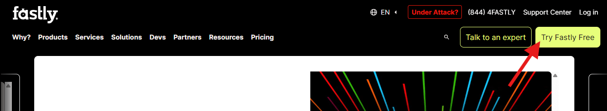
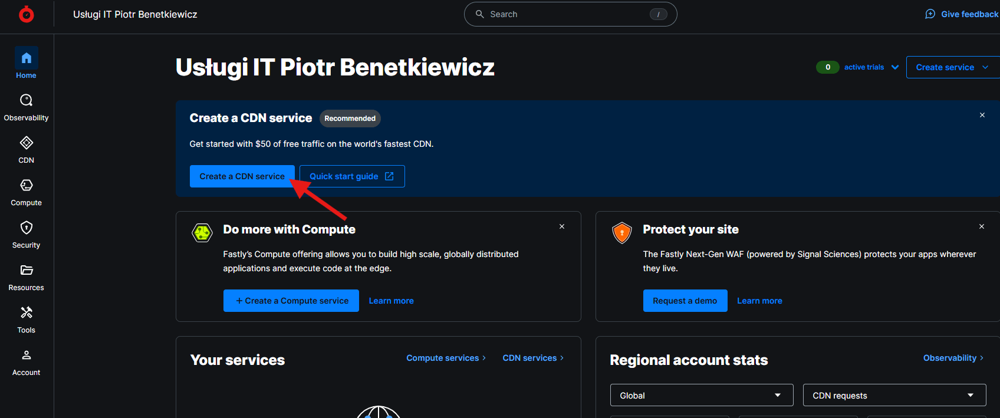
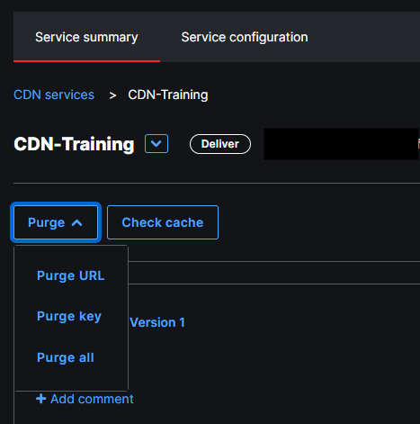
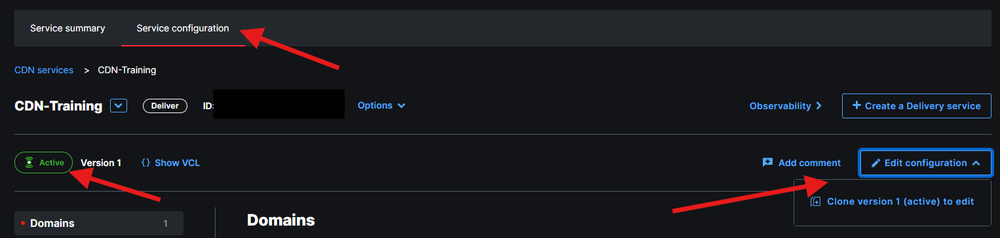

## Prerequisites

In this lesson we will set up Fastly on top of a website, so we'll be able to start exploring it's features and behavior. Two prerequisites that are needed to continue are:

- A website to test on (your Origin)
- Fastly account

In the Lesson 1 we discussed the importance of backend choice. This is where this decision needs to be made. Use whatever language and platform you feel comfortable with. I'll be using node and express.js app, hosted here: [https://cdn-training-acc5b8byapdregby.westeurope-01.azurewebsites.net](https://cdn-training-acc5b8byapdregby.westeurope-01.azurewebsites.net)

## Fastly Caching Setup

If you don't have a Fastly account yet, you can sign up for a free account [here](https://www.fastly.com/signup). Just click on the *Create Account* button and follow the instructions. The account remains free for low traffic and there is no credit card required.

Once you fill in the registration form and convirm your email address, you'll be able to log in and will be presented with the main Fastly services panel. We want to start playing with the CDN services, so click *Create a CDN Service* link. You can either skip the simplified form and dive straight into configuration details or use the form to fast-forward your setup.

Quoting the documentation: *Three simple steps to faster and more powerful applications:*

- Add a domain. This is how users will find your application and content.
- Add a host. This is the cloud service or web server that contains your content that Fastly can cache.
- Activate your service.

In terms of the domain, you don't have to buy and use a new one. For testing purposes, the one that Fastly gives us is perfectly fine. The domain will be *prefix.global.ssl.fastly.net*, where you get to choose your prefix, so use something meaningful to you. I went with *cdn-course*.

A host is your actual web application that you want to put behind the CDN. Remember the CDN basics from the previous lesson? This is the *Origin* we're setting up here. Do not put *https://* or *http://* in the host field. For example, in my case, the app is hosted on Vercel and the URL is *cdn-training.vercel.app*.

The last step is to activate your service. This will make the service start caching content. That's it! You've just created your first CDN service. It should be ready and operational in less than a minute. Go to *prefix.global.ssl.fastly.net* and you should see your app hosted from the cache.

## Initial Testing and Config Adjustments

Vanilla Fastly setup caches all pages and assets of your website and it does that for the period of one hour. We can use that knowledge to test that this is really working. If you have a way to easily change the content on the webpage, then do as follows:

- Go to the page under fastly URL, to make sure it is cached
- Adjust the content of the page under the origin URL and publish the changes
- Verify the changes are visible on the origin
- If you managed to do the above in under an hour, the changes under the fastly URL will not be visible yet.

If you want to see the changes under the fastly URL, you can do one of the following:

- Wait for the cache to expire (1 hour).
- Purge the cache manually.
- Add query parameters to the URL, like ?v=1.1.

To purge the cache manually, you can use the Fastly user interface. Go to your service main page (Service Summary) and find the *Purge* dropdown. It provides options to purge the specific URL or purge all. There's also a third option, purge key, which we will get to in the later part of this course.

Adding query parameter to the URL is also a simple way to force changes to be reflected under the fastly URL. You may notice that even though you will see the new content under the URL with query string, the original URL will keep showing the old content. This will become more clear when we discuss cache keys but for now let's just say that this is creating a new cache entry, enforcing the round-trip to the origin.

## Note on Config Adjustments

Fastly has a partical way of dealing with configuration changes. Each setup is a configuration snapshot. When you make changes, they are not applied immediately. Instead, they are queued and can be applied by activating your current state of configuration. This becomes your new active configuration, which in turn may be cloned, edited and activated, and so on.

Let's have a look at the configuration page for our newly created service. After you click Service Configuration on the main page, you are presented with something that looks like this

First you may notice that your configuration in on Version 1 and is in Active state. This means that most of the settings are read-only. You can only adjust very few things, like edge dictionaries, but we will get to it in a later stages of the course. To make any other changes, you need to clone the active configuration, using the Edit configuration button, followed with Clone version 1 (active). This will produce the second version of the configuration, which is in read/write mode but any changes made to this configuration will not impact the setup until explicitly activated. 