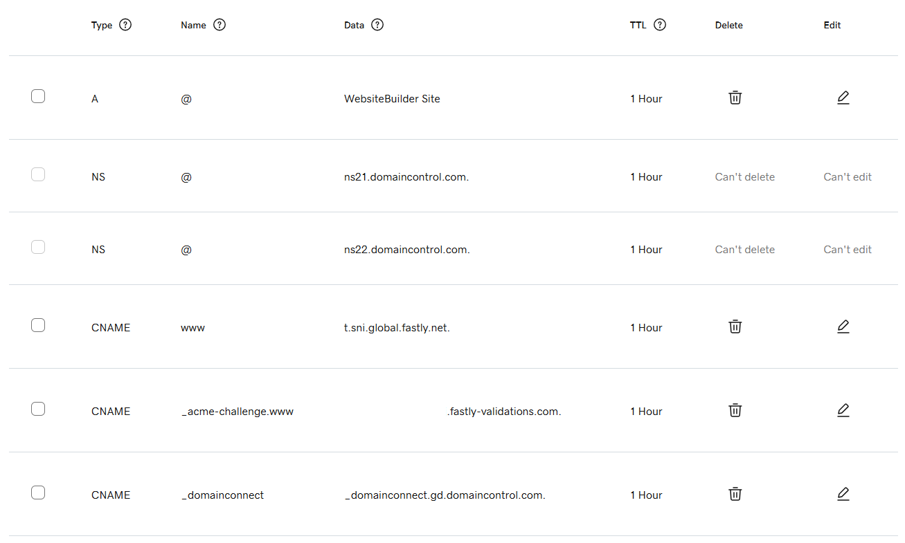

In the previous lesson we configured our Fastly service for basic operations. Part of the initial setup was to create a default, free Fastly domain: prefix.global.ssl.fastly.net. This is perfectly fine for initial testing but you may need to use your own domain for public or production use. In this lesson we will see how to set it up.

## Prerequisites

Obviously you will need a domain. Each domain registar provides access to a given domain DNS settings. Each DNS configuration panel looks slightly different for every domain registrar and also naming of things slightly differs, but you should be able to add and edit your domain CNAME records. Explanation of how CNAME records work is out of scope of this course. In GoDaddy, which is my domain registar, it looks like this:

On the Fastly side we need to obtain the TLS certificate for the domain. This will give us the SSL layer for our setup and the SNI server name that we want to put in the CNAME record to dispatch traffic to Fastly. See step by step instructions below.

## Obtaining the TLS Certificate

Fastly not only provides a CDN service but also a certificate authority. To access the certificate management UI, navigate to the Fastly dashboard, click on the "Security" tab, then select "TLS Management" and finally "Domains." This section allows you to manage your TLS certificates.

But before you can start requesting the certificate, make sure that the domain you request the TLS for is already configured in one of your Fastly CDN services. Assuming you want to use the domain `www.cdn-training.com`, you will replace your existing `prefix.global.ssl.fastly.net` from the previous lesson to `www.cdn-training.com` (or add next to it). Fastly TLS registration process will not allow you to advance if none of your services points to the domain you want to set up TLS for. Please also note that you should register the domain with the www subdomain.

## Proving Ownership of the Domain

After filling in the domain name (you can leave the Cerification authority and Select TLS configuration fields as default) you click submit and the ownership verification process begins. Fastly needs to ensure that the domain belongs to you. To do that, it will require you to create a new CNAME record with the given value. In my case, I had to create a new CNAME `_acme-challenge.www` with a long unique value (also called verification token in some registrars). Fastly will continuously check if the record is created. Once it can confirm the presence of the requested record, you will be presented with the following view:

## Traffic Dispatching Setup

Issuing of the new certificate will take a few minutes. Once it is ready, you will be able to see click it and view/edit its details. One of the certificate properties will be called CNAME records. This is exactly what you need to finish the process on your domain registrar side.

Go back to your domain management panel and similarly to domain ownership verification process, create a new CNAME record with the value provided in the CNAME records property of the certificate details.

There nothing else to do now but wait. Depending on your domain configuration (and some sheer luck) the DNS changes will propagate in few minutes up to an hour. You can check monitor the process of the propagation by using some networking tools, like dig. Once dig shows the CNAME you just configured, you're good to go, and accessing `www.yourdomain.com` should get you to your website through Fastly CDN. Congratulations! 