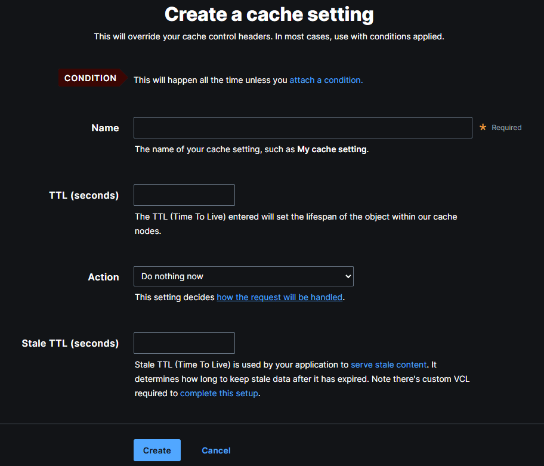

It is finally time to get our hands dirty and play a bit with configuration using Fastly UI and with some HTTP headers. Our example backend app has two more interesting enpoints:
```

https://cdn-training-acc5b8byapdregby.westeurope-01.azurewebsites.net/api/getheaderdate
https://cdn-training-acc5b8byapdregby.westeurope-01.azurewebsites.net/api/getfastlyuidate
```

We'll learn how to change default caching time for a given enpoint in two ways.

## Adjusting Cache with Fastly UI

As explained in one of the previous lessons, to change anything in the Fastly confguration through the Fastly UI you need to first clone your active configuration version. The go to *Settings -> Cache settings* as presented on the following screenshot


You will notice Fastly saying that *There are no cache settings*. Let's go ahead and click *Create your first cache setting* which will present us with the following form:



There are three things we need to provide here:
- **Name**
- **TTL (in seconds)** - for how long should our endpoint be cached. Let's put 15.
- **Condition** - this is how Fastly knows which enpoint or URL this actually applies to

There are to more interesting settings which we will not change right now:
- **Action** - change to *Deliver*, this will become more clear after we learn how Fastly request pipeline works
- **Stale TTL** - serving stale content is a useful scenario in some cases, we will cover that later in the cource

Let's not attach any condition yet, since we don't have one, and click *Create*

It is time to create the new condition, to do that navigate to *Conditions* in the left hand side menu. The condition management looks very similar to cache settings management, so let's just click *Create your first condition*. We need to provide:
* **Name**
* **Type** - one of Request, Response, Cache
* **Apply if…** - a snippet of VCL code that will be our conditional evaluated on each request, essentially the logic of our condition

Obviously we want to create a cache condition, We want to identify some particular requests that match our condition and apply the cache settings to them. Request and response conditions are something else and will also become more obvious after we learn how Fastly request pipeline works. You also need to put the following snippet of code into the *Apply if…* form field:
```varnish
req.url.path == "/api/getfastlyuidate"
```

So `req.url.path` is a little varnish code snippet. `req` is an abstraction over all the information Fastly has about current client request. Since we are interested in matching a specific url path, we compare it to `req.url.path`. Notice that this will work for all query string parameters, meaning `/api/getfastlyuidate?foo=1` also matches this condition. 

After I hit save, I am presented with the following. Notice that Fastly says that this condition is `Not applied to anything`. Let's fix that.


Go back to *Cache settings*, find newly created setting and click *Attach a condition* link right next to it. After you click it, there should be our newly created condition available to choose:


When done, the list of cache configurations looks as follows:


Time to *Activate* our new configuration and test if this worked.

And sure enough, running this poweshell snippet will let you observe time change within 15s:
```powershell

for ($i = 1; $i -le 15; $i++) {
  curl https://cdn-training.global.ssl.fastly.net/api/getfastlyuidate
  Start-Sleep -Seconds 1
}
```

### Hints about making changes in Fastly UI
I encourage you to use the version comment field. It works simiar to git commit message in version control. It appears on the list of previous versions, it is also part of current configuration and the diff between previous and current one. It helps you to maintain and clear history of changes.


From my experience though, managing Fastly via UI works only for small projects and not very advanced setups. It can easily go out of control, especially when you manage test/qa and production environment, since all of developed changes need to be manually propagated from lower to higher environment. This is extremely error prone and quickly causes differences between your qa and prod environment, making testing process unreliable. The solution is to have entire Fastly setup mantained as a code in source control using terraform, which we'll learn in due time.

## Adjusting Cache with HTTP Headers

You can decide about cache setting for your app as above but also the app itself can decide how its output should be cached by setting proper HTTP response headers. There are many HTTP response headers that have impact on how content is cached on CDNs and in client browsers. Two that we're most interested in are:
- **Cache-Control** - the main standard header for controlling both shared (CDN, reverse proxies) amd private (browser) cache. *max-age* property sets the cache time (in seconds)
- **Surrogate-Control** - similar to above but only for shared cache. Fastly prefers this over Cache-Control if both set. Also contains *max-age* property.

Having that said, let's see how `api/getheaderdate` endpoint is implemented:

```javascript

app.get('/api/getheaderdate', (req, res) => {
  res.setHeader('Surrogate-Control', 'max-age=15');
  res.send(new Date().toUTCString());
});
```

You cannot simple make sure that this header is properly set as it is not visible in the response headers by dafault because it is internal slang of CDNs. Fortunately Fastly provides a way to peek some internals it is passing inside its infrastructure. The magic spell is `Fastly-Debug` header:
```powershell

curl -v https://cdn-training.global.ssl.fastly.net/api/getheaderdate -H "Fastly-Debug: 1"
< Fastly-Debug-Path: (D cache-mrs10544-MRS 1742054416) (F cache-mrs10533-MRS 1742054416)
< Fastly-Debug-TTL: (M cache-mrs10544-MRS - - 0)
< Fastly-Debug-Digest: 3117eac8fc1f674e95093f0a8db8f4859f42db5efec2ea93fb376a15a1817543
< Surrogate-Control: max-age=15
```

This endpoint will now behave exactly the same as the `/api/getfastlyuidate` we configured in Fasly UI.