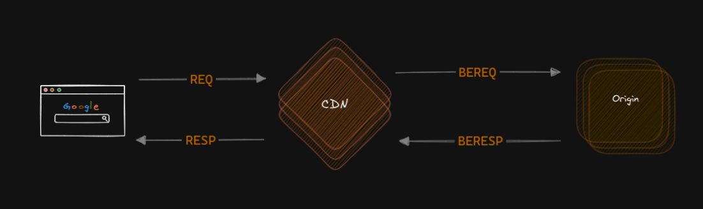
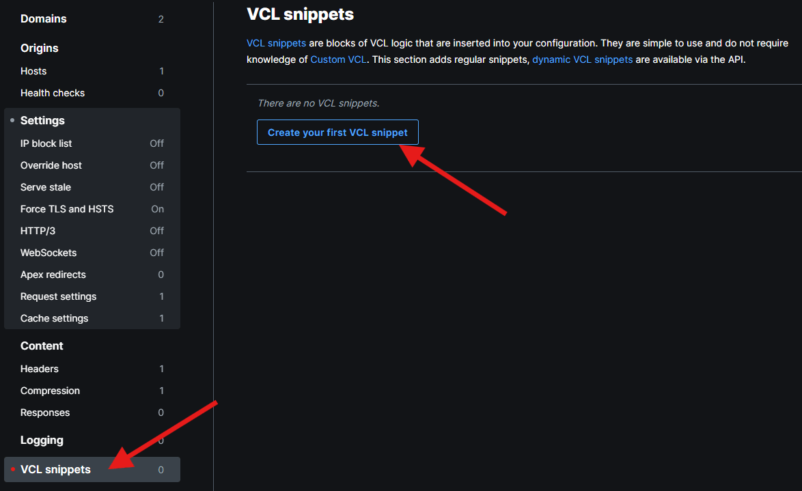
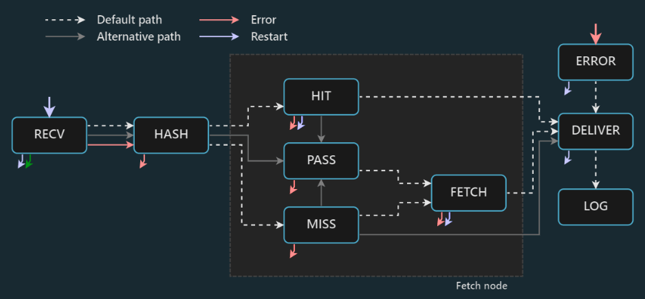

To understand how Fastly processes requests, you need to fully understand regular HTTP communication, including request and response headers. We'll build on top of that.

> VCL stands for Varnish Configuration Language and it is a DSL that abstracts request and response processing plus some additional, convenient APIs (like client information). VCL is not exactly the same as vanilla Varnish but for the sake of our course it is close enough.

First thing you need to realize is that in many cases, client-server communication involves an additional stopover at the POP, similar to a layover during a flight. Fastly has an abstraction over that, strictly distinguishing what's happening between client and POP and what's happening between POP and origin. Request from client to POP is abstracted as *req* and from POP to origin is abstracted as *bereq*. Response from origin to POP is abstracted as *beresp* and from POP to client as *resp*.




It opens up new possibilities, allowing some data to be filtered from client request and never reaching origin and the other way around. Let's have a look at the new test API endpoint that prints back all request headers in response. 

```javascript

app.get('/api/showheaders', (req, res) => {
  res.setHeader('X-value-private', 'this is private');
  res.setHeader('X-value-public', 'this is public');
  res.json(req.headers);
});
```

Let's also look the response headers for that endpoint (many were removed for clarity):
```powershell

curl -v https://cdn-training-acc5b8byapdregby.westeurope-01.azurewebsites.net/api/showheaders
< X-value-private: this is private
< X-value-public: this is public
{
    "user-agent":"curl/8.10.1",
}
```

and compare the result with the same endpoint behind Fastly:
```powershell

curl -v https://cdn-training.global.ssl.fastly.net/api/showheaders
< X-value-public: this is public
< X-value-surprise: surprise!

{
    "user-agent":"curl/8.10.1",
    "fastly-ssl":"1",
    "fastly-client-ip":"78.10.180.120",
    "x-varnish":"323398500, 2327578495",
    "fastly-client":"1",
    "fastly-ff":"JNkryZ+ZXqcBrVdMv/rG07F90MaxUCRxJ1ln7YmRReM=!CPH!cache-cph2320049-CPH, JNkryZ+ZXqcBrVdMv/rG07F90MaxUCRxJ1ln7YmRReM=!CPH!cache-cph2320055-CPH",
    "cdn-loop":"Fastly, Fastly"
}
```

The first thing we notice is that Fastly adds some request headers on the fly (like `fastly-ssl` or `x-varnish`). Second, the `X-value-private` header is gone from Fastly response header but somehow `X-value-surprise` header pops in, even though it is not produced by our test API endpoint. How's that possible?

That magic happens due to the VCL snippet I added to the the service. Snippets allow to plug into request/response pipeline and modify behavior and data being sent. 



I added a snippet with the following data:
- **Name**: Adjust response headers
- **Type**: within subroutine: *fetch*
- **VCL**:
```vcl

if (req.url.path == "/api/showheaders") {
  unset beresp.http.X-value-private;
  set beresp.http.X-value-surprise = "surprise!";
}
```

You may already recognize some syntax from the lesson about caching adjustments (the if statement). `set` and `unset` functions are just the way how we set and clear the headers in VCL.

But what is the `fetch` subroutine and what are the extension points for the request/response pipeline? To explain that, let's have a look at the diagram from Fastly documentation:



At first it may look a bit overwhelming but it actually is very simple. Let's focus on the simplest happy path - the reuest for a page that is already cached.
1. Request comes from the client and it is intercepted in the `recv` subroutine. This is where the processing starts. Typical things you may do here are:
 - normalization or request header/parameters (described in one of the previous lessons)
 - request filtering (stop any further processing based on IP, GEO or any arbitrary condition)
 - backend dispatching (we'll get to that soon)
2. Fastly calculates Cache Key
3. It's a hit! `vcl_hit` subroutine kicks in.
4. We already have a response, so it is time for `vcl_deliver`. It executes just before the response starts to flow back to the client. This typically where you may want to set a cookie or a new response header.

Slightly more complex scenario is for cache miss:
1. Always starts with `vcl_recv`
2. Fastly calculates Cache Key
3. It's a miss - `vcl_miss`
4. Request goes to origin, origin returns response.
5. `vcl_fetch` gets the fresh bits. Modifications made in this will affect the cached entry. This is typically where you would:
 - override cache time 
 - clean up response headers
6. Entry gets cached and delivered - `vcl_deliver`

### Note on Response Headers Removal
You may wonder if for our `/api/showheaders` test the following code would also work while set on `vcl_deliver` (notice using `resp` instead of `beresp`)
```vcl

if (req.url.path == "/api/showheaders") {
  unset resp.http.X-value-private;
  set resp.http.X-value-surprise = "surprise!";
}
```

The answer is Yes! This is not the recommended approach though, since it's being run on each deliver (regardless of hit or miss), while the cached entry still contains the data we want to hide. It's just better to craft the cached entry in the way we want it to be delivered without any additional processing.