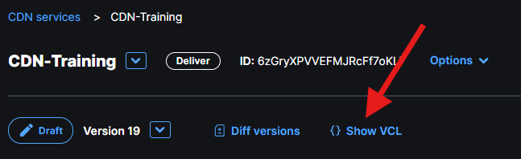

In Lesson 5 we adjusted cache settings for `/api/getfastlyuidate` using Fastly UI. Later, in lesson 6, we learned that there are VCL subroutines where we can plug in to achieve certain effects in various stages of the request-response pipeline. Is Fastly *Cache settings* UI connected somehow with low-level VCL? It sure is!

Let's navigate to *Show VCL*, which can be found at the top in the main Service configuration screen:



From there, use built-in browser search and find `getfastlyuidate` string, which is the name of the enpoint for which we adjusted cache settings via UI. If you'll scroll up a bit to find the surrounding content of the snippet, you'll find something like:
```varnish

sub vcl_fetch {
  declare local var.fastly_disable_restart_on_error BOOL;
#--FASTLY FETCH BEGIN

...

# priority: 10
  if ( req.url.path == "/api/getfastlyuidate" ) {
      # Getdate Fastly UI Cache
      set beresp.ttl = 15s;
      set beresp.grace = 0s;
      return(deliver);
  }

...

#--FASTLY FETCH END

```

That is a proof that everything that happens in your CDN service is just a bunch of VCL subroutines. User interface that Fastly provides is just a one way of managing that code (sometimes not the most convenient). Knowing how it looks like under the hood may sometimes help you understand why your configuration works in a certain way or debug issues.

## Adjusting Cache Time via VCL

In order to do that and not have anything else to interfere with our tests, let's prepare yet another date enpoint:

```javascript

app.get('/api/getttldate', (req, res) => {
  res.send(new Date().toUTCString());
});
```

From our previous lessons we know that we need to plug into the `vcl_receive` subroutine. We also have a pretty good idea of how our snippet should look like to do the trick by looking at the code that was generated by the Fastly UI above. The VCL property that reprsents cache entry freshness is `beresp.ttl`. The common pitfall in this case is that this is not enough because deep in the Fastly documentation there is the following statement:

> If the response does not have any of Cache-Control: max-age, Cache-Control: s-maxage or Surrogate-Control: max-age headers, set beresp.ttl to the fallback TTL configured for your Fastly service.

Since our endpoint is 100% vanilla and does not respond with any of the cache-controlling headers, we need to pick something from the list. I'll use the `Cache-Control: max-age=0` header to make sure that browsers will not use client cache for the response. That setup should give similar results while testing from the cacheless tool like *curl* but also from the internet browser, even without any hacks in Developer tools.

To summarize, we need the following snippet:
- **Name**: Adjust TTL
- **Type**: fetch
- **VCL**:
```varnish

if (req.url.path == "/api/getttldate") {
  set beresp.http.Cache-Control = "max-age=0";
  set beresp.ttl = 10s;
}
```

And sure enough - `/api/getttldate` endpoint configured that way responds with a fresh date every ~10s. 

It is also worth to test that in the browser, to see how it obeys the `Cache-Control` header:
- first call (*MISS*) gets HTTP 200 OK response
- `max-age: 0` tells the browser that the response is immediately stale
- next browser request goes with `if-none-match` request header, to confirm if the cached resource is still valid
- POP responds with HTTP 304 Not Modified, so the browser uses cached copy