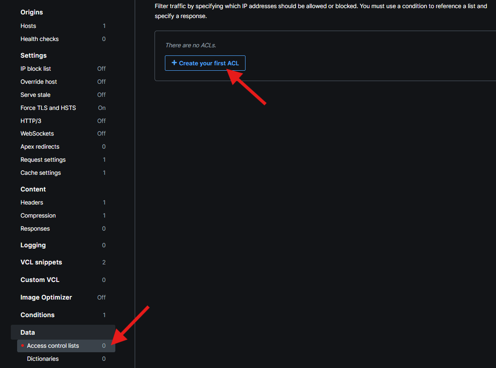
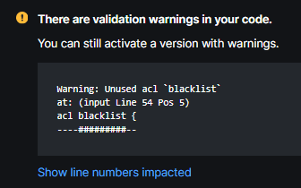
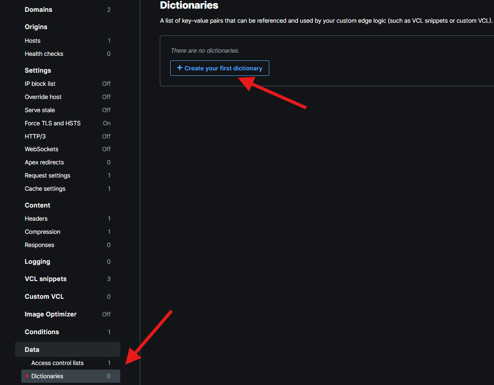

## ACLs

ACL stands for Access Control List. It is a simple data structure designed to store IP addresses. There's also VCL API to check whether a given value is present on the list. The most common applications for ACLs are:
* banning/blocking IP 
* tricking IP to consume fake response (very useful for scrapers!)
* origin dispatching per IP
* whitelisting IP (ex. to never get rate limiting)

Let's implement the simplest block feature. First we need to create the ACL:



The only thing to provide on the Create ACL form is name. It should be self-explanatory because it will be used as a handle to reference to in the VCL. Note that right after ACL creation, Fastly will throw a warning about unused ACL. We'll fix it in a moment.



We need a new snippet:
* **Name:** Handle blacklist
* **Type:** recv
* **VCL**:

```varnish

if (client.ip ~ blacklist) {
  error 401 "Unauthorized";
}
```

After this configuration will be activated, nothing will change until you add an entry to the blacklist ACL. Try accessing any of the Fastly endpoints we added so far and they should work. Then find and add your IP to the blacklist. Note that ACL entries are cross-configuration entities - once you created ACL and activated configuration containing it, you can add and remove entries while this configuration (and subsequent configurations) are applied. Changes are almost real-time.

```varnish

curl -v https://cdn-training.global.ssl.fastly.net/api/getdate
< HTTP/1.1 401 Unauthorized
```

## Edge Dictionaries

Edge dictionaries are data structures very similar to dictionaries we know from other high-level programming languages, as they store data in key-value pairs. However, unlike traditional dictionaries, edge dictionaries are hosted and distributed across Fastly's Points of Presence (POPs), making them accessible globally with low latency. They also provide a VCL API to check the presence of a key and retrieve its value. They are common in the following scenarios:
* feature flags
* route maps
* traffic dispatching
* storing configuration values

To illustrate how edge dictionaries work let's implement a feature flag for our existing `/api/showheaders` endpoint. Similar to ACL, we first need to create the dictionary itself in order to be able to reference it in the VCL snippet. Also similar to ACL, only the name is required.



It is time for a new VCL snippet:
* **Name:** Handle feature flags
* **Type:** recv
* **VCL**:

```varnish

if (req.url.path == "/api/showheaders") {
  if (!table.contains(feature_flags, "showheaders_enabled") || table.lookup(feature_flags, "showheaders_enabled") == "false") {
    error 404 "Not Found";
  }
}
```
The important bits here are:
- `table.lookup` gets the value from the given dictionary under the specified key
- `table.contains` checks if the entry with a given key exists

After this new configuration will be activated, `/api/showheaders` should start returning 404. To access that endpoint, go to *feature_flags* dictionary and add new dictionary entry with *showheaders_enabled* key and value set to *true*. Give it a second to propagate and you should be able to access the endpoint again. If you have a bad memory (as I do), remember to remove your IP address from the blacklist ACL or you'll get 401 instead of expected results.

## Client Variable and Custom Errors

VCL provides many interesting properties describing client requests. To highlight some:
- client.as.name
- client.geo.country_code
- client.platform.mobile

They allow to build pretty complex on-edge logic that would otherwise be hard or inefficient to implement on origin. To combine few advanced VCL features into a single example, let's build an artificial endpoint greeting only the mobile users. This will be fully on the Fastly side, no new endpoints will be added to the origin app. 

How does that work? First, we need to go back to Lesson 6 and the state diagram that shows how request-response lifecycle works. You can see there that each subroutine can throw an error (a red arrow going out of it) and there's error subroutine that handles these errors (red arrow going in). Moreover, VCL supports error code values going beyond standard HTTP error values. In process, the vcl_error subroutine can catch only these errors, produce response (including HTML, custom headers, cookies, etc.) and deliver it.

First, let's throw custom error if a given request comes from a mobile device. We need a new `vcl_recv` snippet with the following code:

```varnish

if (client.platform.mobile && req.url.path == "/api/hello") {
  error 601;
}
```

and the error handling snippet `vcl_error` looks as follows:

```varnish

if (obj.status == 601) {
  set obj.status = 200;
  set obj.response = "OK";
  set obj.http.Content-Type = "text/plain";
  synthetic "Hello mobile user";
  return (deliver);
}
```

In the above code we catch the custom error code we just produced, adjust it to HTTP 200 OK, set content-type, friendly message and force-push control straight to deliver phase. With that configuration enabled, we get 404 if we run vanilla curl:

```powershell

curl -v https://cdn-training.global.ssl.fastly.net/api/hello
< HTTP/1.1 404 Not Found
```

but using curl with a user agent string that simulates a mobile device for testing purposes returns the greeting as expected.

```powershell

curl -v https://cdn-training.global.ssl.fastly.net/api/hello \
  --user-agent 'Mozilla/5.0 (iPhone; CPU iPhone OS 16_5 like Mac OS X) \
  AppleWebKit/605.1.15 (KHTML, like Gecko) \
  CriOS/114.0.5735.99 Mobile/15E148 Safari/604.1'
< HTTP/1.1 200 OK
<
Hello mobile user
```
