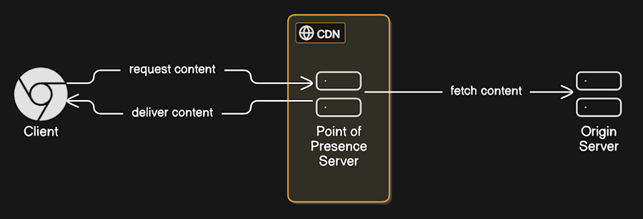

# Lesson 1: Introduction to CDNs

## Basic Idea

Content Delivery Networks (CDNs) are a crucial part of modern web infrastructure. They are geographically distrubuted servers, which are physically and logically closer to the end user, delivering web content faster and more efficiently.

The idea is that each client worldwide, instead of fetching content from one, centralized server across the world, can fetch content from a server that is closer to them. This reduces latency and improves the overall performance of the website. The process of determining which server is nearest and contains the requested content relies on protocols that govern the internet. Various CDN providers primarily use Anycast Routing or GeoDNS, both of which are integrated into the DNS protocol.

The servers spread across the world are *Edge servers* or *POPs (Points of Presence)*. The server that actually server the content is called a *Origin Server*. Each POP contains a cached copy of the content. See the below diagram for a visual representation of how CDNs work.



In some more advanced scenarios, one of the POPs has a special role of being a *Shield* server. Shield usually stands close to the origin server and is used as a kind of proxy to distribute content to the rest of the POPs network. Since the Shield is the only POP fetching content from the origin, it essentially shields the origin from the flood or requests coming from all POPs in the network.

The content is cached in the POPs for a certain period of time, after which it is deleted to make space for new content. The length of the caching time, the parts of the content that should be cached and strategies for caching can be configured in many ways via the UI, HTTP headers being sent by origin or special scripting (such as VCL in Varnish) deployed as part of CDN configuration.

## Other features of CDNs

CDNs can do much more than just cache content. They can also be used to:

- Filter incoming traffic, acting as a first line of defense agains not sophisticated attacks, like scraping o DoS.
- Dispatch traffic to multiple origins, load balancing between them or allowing downtime-free migrations between them.
- Allow to implement basic functionalities, like AUTH or A/B testing.
- Often are bundled with other features, like DDoS protection, WAFs, image iptimization,etc.

## Fastly

The main focus in this course is Fastly, one of the most popular CDN providers. It is a perfect fit for our journey into the world of CDNs since it follows industry standards and offers free tier for projects with small traffic.

There are a lot of competitors in this field: Akamai, Cloudflare, Cloudfront, etc. They may vary in terms of features they provide but underlying concepts are the same and after this course you should be able to understand how to use them as well.

## Choice of Backend

The main goal of this course is deep understanding how POPs and Origin cooperate with each other. We'll be adjusting CDN configuration via Fastly UI and varnish code snippets but you must also know that backend can have a big impact on how caching works. Due to that, we'll be implementing a simple backend endpoints and returning some HTTP headers from the backend that will allow us to demonstrate all the concepts we'll cover in this course.

My stack of choice is nodejs and express.js. However, you can use any other backend you want. This is not a programming course, so code snippets will be extremely simple and should be easy to translate into different proraming languages and their frameworks. As long as you understand any the following code snippets, you should be good to go.

```csharp

using Microsoft.AspNetCore.Builder;
using Microsoft.AspNetCore.Http;

var builder = WebApplication.CreateBuilder(args);
var app = builder.Build();

app.MapGet("/", () => "Hello, World!");

app.Run();
```
&nbsp;
```javascript

const http = require('http');

const server = http.createServer((req, res) => {
    res.writeHead(200, { 'Content-Type': 'text/plain' });
    res.end('Hello, World!');
});

server.listen(3000, () => {
    console.log('Server is running on port 3000');
});
```

Please also be aware that some of the service support their own CDN/edge network, which means that you will experience some caching by default. These features may stack on top of Fastly's caching and some of the concepts may not work as described in this course. Azure App Services provide "vanilla" hosting, which is perfect for this course.
